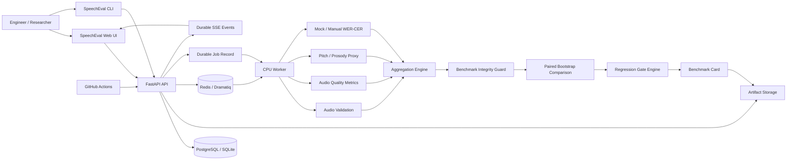
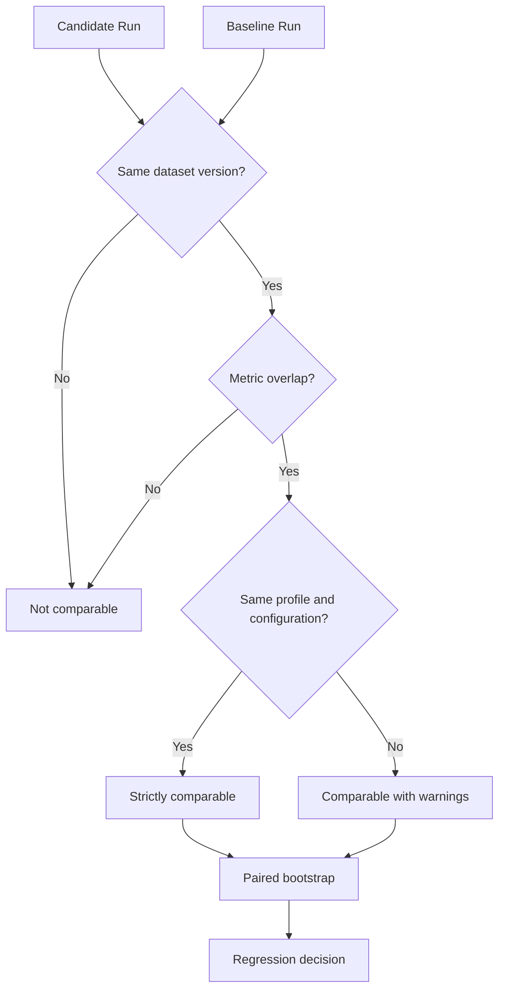
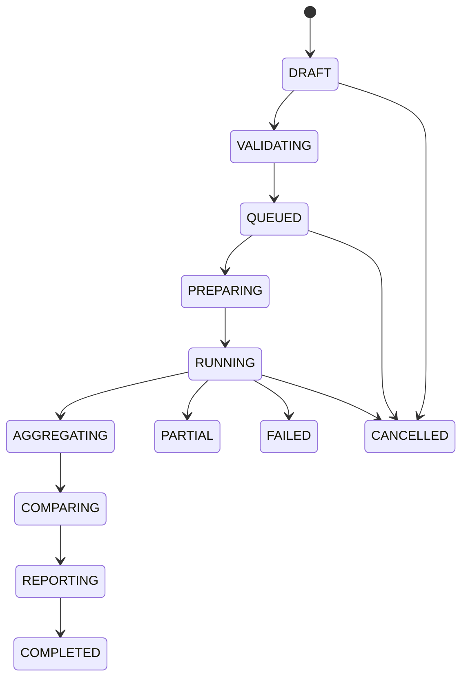
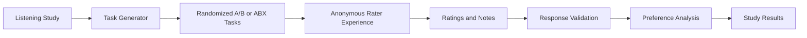
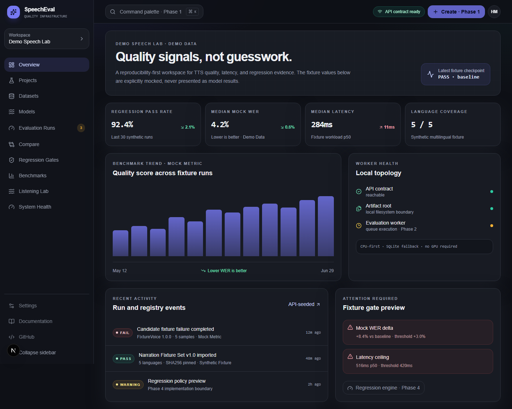
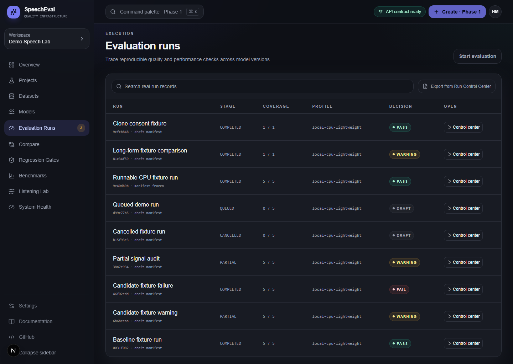
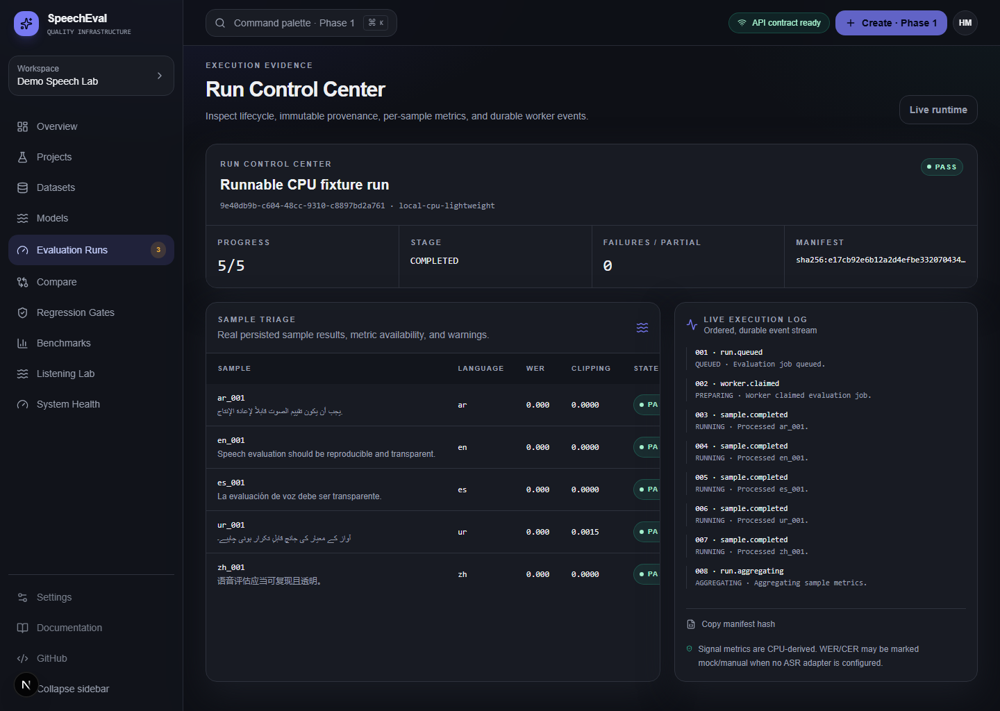
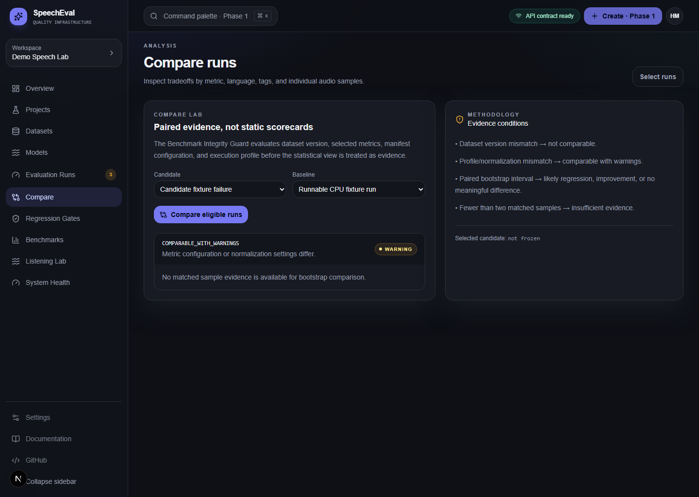
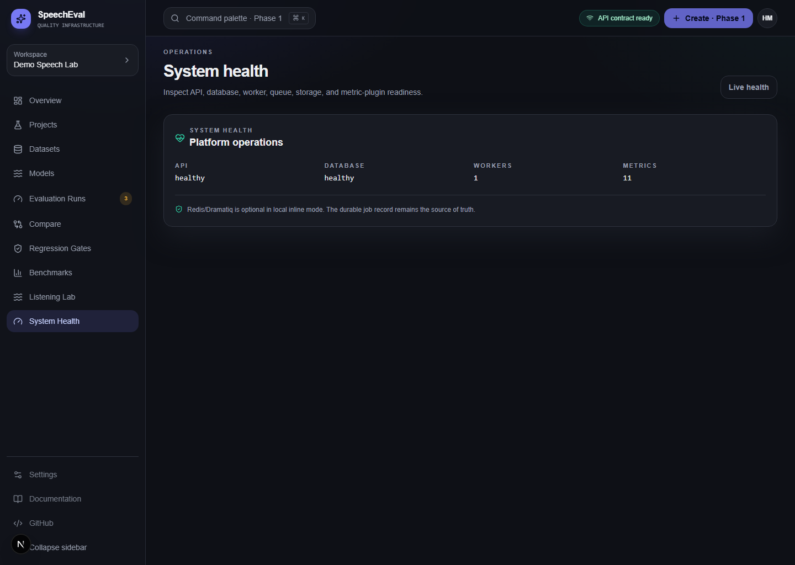

# ✦ SpeechEval

> **SpeechEval is a reproducible speech reliability platform for evaluating TTS systems, detecting regressions, comparing model versions, and producing traceable benchmark evidence.**

[](https://github.com/HUSNAIN-MUNAWAR/speecheval/actions/workflows/backend-ci.yml)
[](https://github.com/HUSNAIN-MUNAWAR/speecheval/actions/workflows/frontend-ci.yml)
[](https://github.com/HUSNAIN-MUNAWAR/speecheval/actions/workflows/e2e.yml)
[](LICENSE)
[](backend/pyproject.toml)
[](apps/web/package.json)

SpeechEval is a CPU-first, artifact-backed platform for TTS researchers, ML platform teams, open-source maintainers, and consultants. It does not reduce speech quality to one invented score: it preserves dataset versions, metric versions, execution profiles, samples, artifacts, statistical evidence, and regression decisions.

> **Phase 2 implementation status:** the local artifact-only evaluation engine, CPU signal metrics, durable run/job/event records, content-hashed artifacts, immutable v2 manifests, integrity checks, paired bootstrap comparisons, regression policies, benchmark cards, Listening Lab APIs, CLI, and API-backed application surfaces are implemented. Optional live ASR, speaker embeddings, external TTS HTTP calls, controlled model containers, S3/MinIO storage drivers, API tokens are extension points—not silently claimed as active. Redis-backed Dramatiq delivery is available when `SPEECHEVAL_QUEUE_MODE=dramatiq` (the Compose default).

[Quickstart](docs/guides/quickstart.md) · [Architecture Notes](docs/architecture/overview.md) · [API Overview](docs/api/overview.md) · [CI Examples](examples/github-actions)

## Why not just WER?

TTS quality is multi-dimensional. A model can improve transcript accuracy while becoming slower, louder, clipped, or less stable across languages. A number only has engineering value when the dataset, normalization path, metric version, sample exclusions, model release, and execution context are recorded.

- **Real CPU metrics:** PCM WAV validation, duration, silence ratio, clipping, estimated loudness, pitch variation proxy, speech rate, multilingual baseline normalization, mock/manual WER/CER, and performance telemetry.
- **Explicit provenance:** mocked and estimated outputs remain labeled; unavailable plugins are stored as explicit results rather than disappearing.
- **Benchmark Integrity Guard:** comparisons are classified as `STRICTLY_COMPARABLE`, `COMPARABLE_WITH_WARNINGS`, or `NOT_COMPARABLE`.
- **Evidence-based release gates:** paired bootstrap confidence intervals and policy decisions avoid mean-only claims.
- **Listening Lab:** controlled A/B, ABX, and rating-study records with randomized task order and deliberately cautious interpretation.

## Architecture

The rendered overview below is backed by the source diagrams in [`docs/diagrams/`](docs/diagrams/), including [`system-architecture.mmd`](docs/diagrams/system-architecture.mmd), [`evaluation-lifecycle.mmd`](docs/diagrams/evaluation-lifecycle.mmd), and [`benchmark-integrity-guard.mmd`](docs/diagrams/benchmark-integrity-guard.mmd).









## Quick start — CPU-only

```bash
cp .env.example .env
make bootstrap
make db-migrate
make seed
```

In separate terminals:

```bash
make api
make web
```

- Web: `http://localhost:3000`
- API docs: `http://localhost:8000/docs`
- Prometheus-formatted metrics: `http://localhost:8000/api/v1/system/metrics`

For a single-process local demo run:

```bash
cd backend
speecheval demo seed
speecheval run enqueue <draft-run-id>
speecheval run inspect <run-id>
```

`inline` mode executes locally on CPU. Compose sets `SPEECHEVAL_QUEUE_MODE=dramatiq`, where the API publishes durable job UUIDs through Redis and the worker runs `dramatiq app.workers.tasks`. The durable database job remains the idempotency and audit source of truth; Redis is only the delivery transport.

## Product tour

The screenshots below come from the seeded demo workspace plus a real inline fixture run executed locally for this repository.



| Evaluation runs | Run Control Center |
|---|---|
|  |  |

| Compare Lab | System health |
|---|---|
|  |  |

## Real CPU metric surface

| Metric | Status | Notes |
|---|---|---|
| Audio validation | Real | PCM WAV decode, sample rate, channels, checksum, waveform downsample, zero-byte/corruption failure |
| Duration | Real | Audio duration and duration-per-word |
| Silence ratio | Real | Frame-energy silence segments, leading/trailing/longest silence |
| Clipping | Real | Peak, clipping count/ratio, near-clipping, dynamic-range proxy |
| Loudness | Real when available | `pyloudnorm` integrated LUFS; explicit RMS estimate only if the meter cannot run |
| Pitch/prosody | Estimated | CPU autocorrelation F0 proxy; does not measure emotion or naturalness |
| Speech rate | Real | Text-per-duration rates |
| Text normalization | Real baseline | English, Urdu, Arabic, Spanish, Mandarin-safe normalization hooks |
| WER/CER | Mock/manual | Deterministic transcript adapter, visibly labeled until optional ASR is configured |
| Speaker similarity | Unavailable | Requires optional embedding adapter and reference-audio policy |

## Reproducibility

Every queued run freezes a `speecheval_manifest_version: "2.0"` document containing dataset hash, model version, profile, metric IDs/versions, host information, source timestamp, and artifact hash strategy. A manifest is content-hashed and persisted as an artifact.

## Benchmark and policy workflow

```bash
speecheval baseline create --run <completed-run-id>
speecheval baseline freeze <baseline-id>
speecheval compare <candidate-run-id> <baseline-run-id>
speecheval policy test <policy-id> <candidate-run-id>
speecheval run benchmark-card <run-id>
```

Policy decisions expose observed and baseline values, absolute and relative deltas, confidence intervals, matched sample count, integrity state, and a human-readable explanation.

## Listening Lab

The Listening Lab exposes A/B preference, ABX, MOS-style rating, naturalness, intelligibility, and similarity study contracts. It does **not** claim ratings are scientific by default. Treat default reports as exploratory internal feedback until recruitment, consent, randomization, rater calibration, and methodology are formally defined.

## Docker

```bash
cp .env.example .env
docker compose up --build
```

Services: `web`, `api`, `worker`, `postgres`, `redis`, and optional-profile `minio`.

## CI integration

See:

- `examples/github-actions/tts-regression.yml`
- `examples/github-actions/speecheval-pr-comment.yml`

The CI example validates a manifest, evaluates a persisted candidate run, renders Markdown, and returns a non-zero exit code for likely regressions or invalid comparisons.

## Repository guide

```text
backend/app/execution/     lifecycle, profiles, immutable manifests, durable events
backend/app/workers/       inline dispatcher, Dramatiq transport, polling fallback, CPU executor
backend/app/metrics/       versioned plugin contract and CPU signal implementations
backend/app/comparison/    integrity guard and paired bootstrap evidence
backend/app/listening/     task generation, response validation, cautious results
backend/app/artifacts/     path-safe local content-addressable storage
apps/web/                  Run Control Center, Compare Lab, evidence/health surfaces
docs/                      operational and methodology documentation
```

## Limitations and responsible use

- Evaluate only audio you are authorized to process.
- Reference voice audio requires consent and retention controls.
- Acoustic embedding similarity is not identity verification.
- Default WER/CER is mock/manual until an ASR adapter is intentionally configured.
- Estimated loudness and pitch proxies should not be used for safety-critical or broadcast certification.
- Local artifact paths are never exposed directly; route handlers validate safe relative storage keys.

See `SECURITY.md`, `CONTRIBUTING.md`, `docs/security/data-governance.md`, and `docs/benchmarking/methodology.md`.

## License

MIT. See `LICENSE`.
